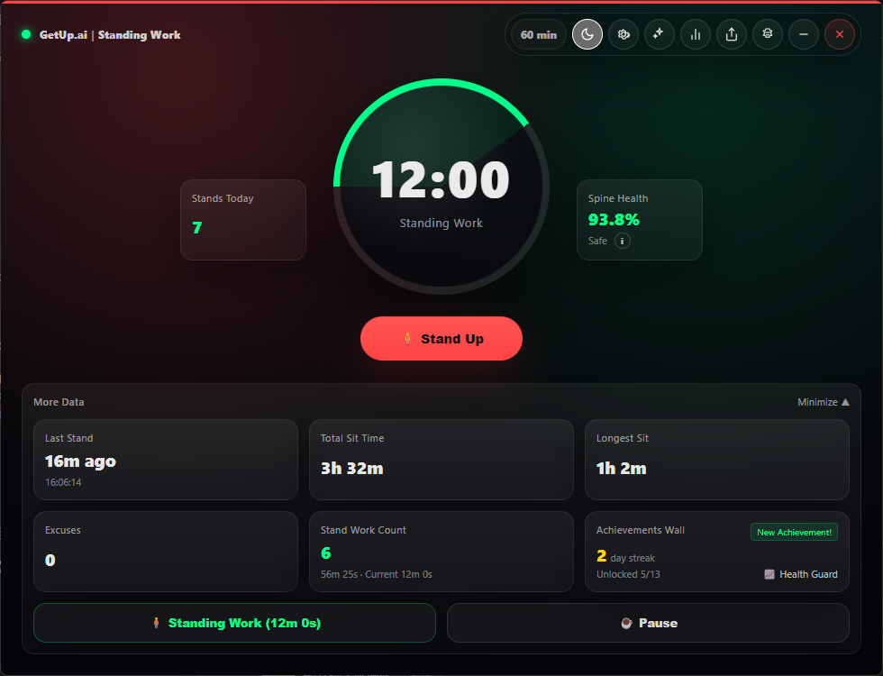
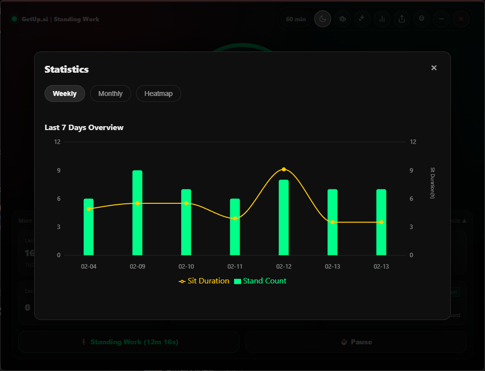
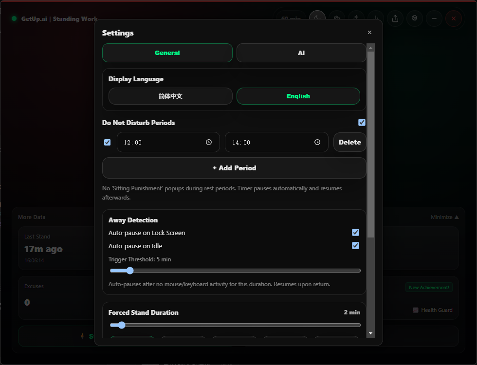

# GetUpAI

[English](./README.md) | [简体中文](./README.zh-CN.md)

An Electron + React desktop app built to fight sedentary work habits. When your timer runs out, it interrupts you and pushes you to stand up, while keeping app state local and calling your configured AI provider directly.

> Your spine is not a disposable part.

## Screenshots

| Home | Daily Report | Settings |
|:----:|:------------:|:--------:|
|  |  |  |

## Features

### Core Loop

```
Work timer (60 min by default) -> intervention popup -> stand / justify / ignore -> log result -> restart timer
```

### AI Coaching Moments

| Moment | Trigger | Purpose |
|--------|---------|---------|
| A · Prompt | Countdown reaches zero | Generates a coaching line from your sedentary data |
| B · Judgment | User submits an excuse | Produces an AI pause suggestion and reply |
| C · Review | Manually triggered / app exit | Generates an AI daily review and saves it to history |
| D · Movement Guide | During standing phase | Produces AI-guided stretch routines (name, duration, instructions) |

Coaching supports three personalities: Gentle / Strict / Drill Instructor (switchable in settings).

### Motivation System

- **Daily streaks**: Standing at least once per day counts as a successful check-in
- **Achievement badges**: 13 built-in achievements (first stand, 7/30/100-day streaks, 10/20 stands in one day, zero-excuse day, etc.)
- **Achievement popup**: Celebration animation on unlock
- **Daily goal**: Configurable stand target (default: 6) with progress tracking

### Smart Reminder Strategy

- **Time-slot analytics**: Tracks ignore/compliance rate across morning/afternoon/evening/late night
- **Adaptive interval**:
  - Ignore rate > 50% in a slot: shorten interval by 20%
  - Compliance rate > 80% in a slot: lengthen interval by 20%
  - Ignored 3 times in a row: next interval is halved
- **Escalation levels**:
  - 10 minutes left -> system notification
  - 5 minutes left -> in-app toast
  - 0 minutes left -> full-screen intervention popup

### Data Visualization

- **Weekly view**: Last 7 days stand count (bar) + sedentary duration (line)
- **Monthly view**: Last 30 days spinal-health trend (area)
- **Sedentary heatmap**: Hourly sedentary distribution to identify high-risk periods

### Lightweight Sharing

- **Daily result card**: Generates a shareable image with daily stats, streak, and AI review
- **Save / copy**: Save locally or copy to clipboard for social sharing

### Context Awareness

- **Lock-screen detection**: Pauses timer when system is locked
- **Idle detection**: Pauses timer when no keyboard/mouse activity exceeds threshold (default: 5 min)
- **Auto resume**: Resumes automatically when user returns

### Other Capabilities

- **Standing work mode**: Track standing duration while pausing sedentary timer
- **Do Not Disturb (DND)**: One-click pause for all reminders
- **Rest windows**: Multiple custom schedules (e.g. lunch 12:00-13:00), auto pause with optional early end
- **Tray resident mode**: Close main window to tray; reopen/quit from tray
- **Forced standing duration**: Adjustable from 1-30 min
- **Quick pause**: 15 / 30 / 60 min shortcut pause buttons
- **Persistent state**: Data survives restart, with automatic cross-day archiving

## Tech Stack

| Layer | Technology |
|-------|------------|
| Framework | Electron 30 + React 18 |
| Language | TypeScript |
| Build | Vite 5 |
| State management | Zustand 4 (persist middleware) |
| Routing | React Router 6 (HashRouter) |
| Packaging | Electron Builder |
| AI | Direct OpenAI-compatible provider calls |
| Charts | Recharts |
| Image generation | html2canvas |

## Project Structure

```
GetUpAI/
├── clients/
│   └── desktop/              # Electron + React desktop app (main project)
│       ├── src/
│       │   ├── ai/           # AI context, prompt templates, streaming calls
│       │   ├── components/   # UI components (achievements, charts, share cards, etc.)
│       │   ├── pages/        # DashboardPage, PopupPage
│       │   ├── store/        # Zustand global store
│       │   └── utils/        # Helpers (achievement checks, reminder strategy, image generation, etc.)
│       ├── electron/         # Electron main process, preload
│       ├── build/            # Icons, installer scripts
│       └── dist-electron/    # Electron main process build output
└── shared-logic/             # Shared business logic (Persona definitions, prompt generation)
```

## Local Development

```bash
cd clients/desktop
npm install
npm run electron:dev
```

Production-style preview (without localhost):

```bash
npm run electron:start
```

## Build & Release

> Electron Builder can only generate installers for the current OS.

```bash
cd clients/desktop
npm install
npm run dist          # current platform
npm run dist:win      # Windows (NSIS)
npm run dist:mac      # macOS (DMG + ZIP)
npm run dist:linux    # Linux (AppImage)
```

Output directory: `clients/desktop/release-out/`

## Local-Only Build

This repository now targets a fully local desktop app for open-source distribution.

- No sign-in
- No cloud sync
- No deployed API server
- No remote admin publishing page
- No hosted update-check endpoint

## Compatibility

- **Windows**: NSIS installer, supports custom install directory
- **macOS**: Tray uses template image for dark mode compatibility
- **Linux**: AppImage format
- Build scripts are cross-platform and avoid running PowerShell/NSIS steps on non-Windows systems

## Roadmap

### ✅ Phase 1: Core Experience Upgrade (Done)
- Motivation & achievement system
- Smart reminder strategy
- AI movement guide

### ✅ Phase 2: Insights & Sharing (Done)
- Data visualization (weekly/monthly/heatmap)
- Lightweight sharing (daily result image)

### ✅ Phase 3: Context Awareness (Done)
- Lock-screen / idle detection

### 🔮 Future
- Calendar integration (smart adjustment during meetings)
- Better offline local coaching and rule customization
