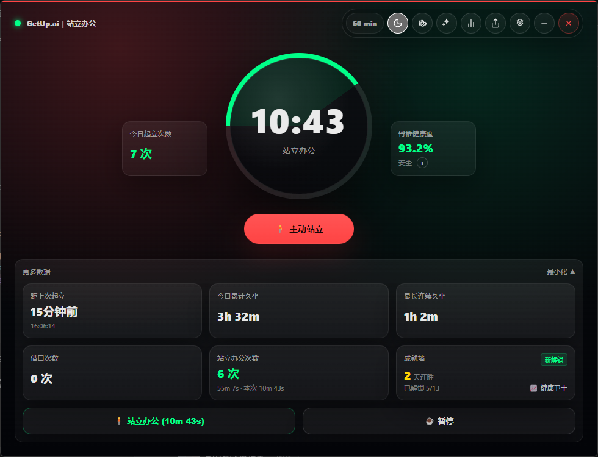
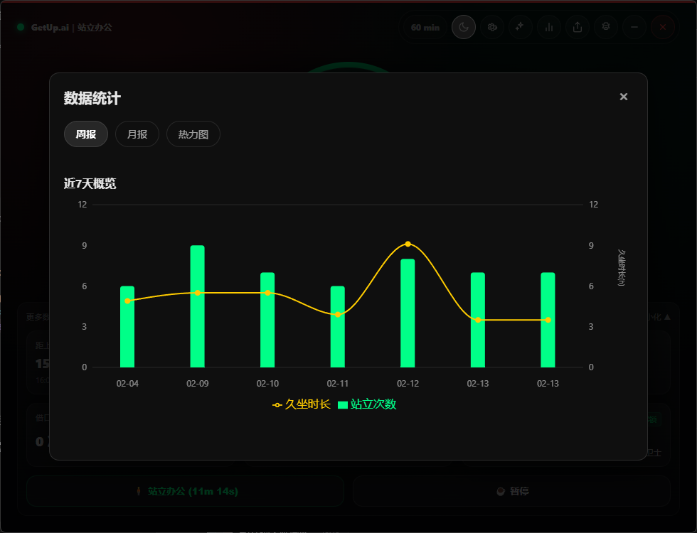
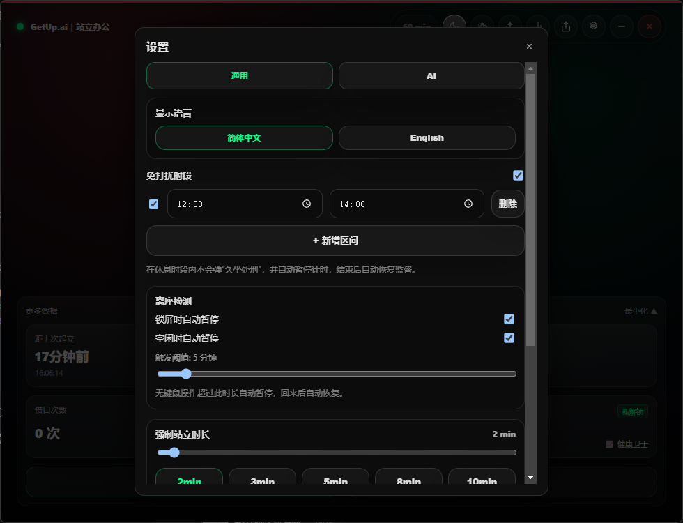

# GetUpAI

[English](./README.md) | [简体中文](./README.zh-CN.md)

一个基于 Electron + React 的「反久坐」桌面监督应用。到点弹窗逼你站起来，应用状态保存在本机，AI 直接调用你配置的大模型厂商接口。

> 你的脊椎不是一次性耗材。

## 截图

| 首页 | 每日报告 | 设置 |
|:----:|:--------:|:----:|
|  |  |  |

## 功能

### 核心循环

```
工作计时（默认 60min）→ 弹窗干预 → 站立 / 申辩 / 忽略 → 记录 → 回到计时
```

### AI 提醒四个瞬间

| 瞬间 | 触发时机 | 作用 |
|------|---------|------|
| A · 催促 | 倒计时归零 | 根据你的久坐数据生成 AI 提醒文案 |
| B · 裁决 | 用户提交借口 | 给出 AI 暂停建议和回复 |
| C · 点评 | 手动触发 / 退出时 | 生成 AI 每日点评，并保存到历史 |
| D · 运动引导 | 站立阶段 | 生成 AI 拉伸动作序列，每个动作包含名称、时长、说明 |

提醒文案支持三种性格：温和 / 严厉 / 军训教官，可在设置中切换。

### 激励系统

- **连续打卡**：每天至少站立 1 次算打卡成功，累计连续天数
- **成就徽章**：13 个预设成就（首次站立、连续 7/30/100 天、单日 10/20 次、零借口日等）
- **成就弹窗**：解锁时弹出庆祝动画
- **每日目标**：可设置每日站立次数目标（默认 6 次），显示达成进度

### 智能提醒策略

- **时段统计**：分析上午/下午/晚上/深夜的忽略率和配合率
- **自适应间隔**：
  - 忽略率 > 50% 的时段：间隔缩短 20%
  - 配合率 > 80% 的时段：间隔放宽 20%
  - 连续忽略 3 次：下次间隔减半
- **分级干预**：
  - 剩余 10 分钟 → 系统通知
  - 剩余 5 分钟 → 应用内 toast 提醒
  - 倒计时归零 → 全屏处刑弹窗

### 数据可视化

- **周报视图**：最近 7 天站立次数（柱状图）+ 久坐时长（折线图）
- **月报视图**：最近 30 天脊椎健康度趋势（面积图）
- **久坐热力图**：按小时统计久坐分布，识别高危时段

### 轻量分享

- **每日战绩卡**：生成包含当日数据、连续打卡天数、AI 点评的精美图片
- **保存/复制**：可保存到本地或复制到剪贴板，分享到社交平台

### 场景感知

- **锁屏检测**：系统锁屏时自动暂停久坐计时
- **空闲检测**：鼠标/键盘无操作超过阈值（默认 5 分钟）时自动暂停
- **自动恢复**：用户回来后自动恢复计时

### 其他功能

- **站立办公模式**：站着工作时开启，计入站立时长，暂停久坐计时
- **勿扰模式（DND）**：一键暂停所有提醒，手动解除后恢复
- **休息时段**：支持多个自定义时间窗口（如午休 12:00-13:00），到点自动暂停，支持提前结束
- **托盘常驻**：关闭主窗口后隐藏到系统托盘，可从托盘打开或退出
- **强制站立时长**：可调节 1-30 分钟
- **快捷暂停**：15 / 30 / 60 分钟快捷暂停按钮
- **状态持久化**：关闭重开不丢数据，跨天自动归档

## 技术栈

| 层 | 技术 |
|----|------|
| 框架 | Electron 30 + React 18 |
| 语言 | TypeScript |
| 构建 | Vite 5 |
| 状态管理 | Zustand 4（persist middleware） |
| 路由 | React Router 6（HashRouter） |
| 打包 | Electron Builder |
| AI | 直连 OpenAI 兼容模型厂商 |
| 图表 | Recharts |
| 图片生成 | html2canvas |

## 目录结构

```
GetUpAI/
├── clients/
│   └── desktop/              # Electron + React 桌面端（当前主项目）
│       ├── src/
│       │   ├── ai/           # AI 上下文、Prompt 模板、流式调用
│       │   ├── components/   # UI 组件（成就、图表、分享卡片等）
│       │   ├── pages/        # DashboardPage、PopupPage
│       │   ├── store/        # Zustand 全局状态
│       │   └── utils/        # 工具函数（成就判定、提醒策略、图片生成等）
│       ├── electron/         # Electron 主进程、preload
│       ├── build/            # 图标、安装脚本
│       └── dist-electron/    # Electron 主进程编译产物
└── shared-logic/             # 通用业务逻辑（Persona 定义、Prompt 生成）
```

## 本地开发

```bash
cd clients/desktop
npm install
npm run electron:dev
```

无 localhost 的生产模式预览：

```bash
npm run electron:start
```

## 打包发布

> Electron Builder 只能在对应系统上生成对应平台的安装包。

```bash
cd clients/desktop
npm install
npm run dist          # 当前平台
npm run dist:win      # Windows (NSIS)
npm run dist:mac      # macOS (DMG + ZIP)
npm run dist:linux    # Linux (AppImage)
```

产物目录：`clients/desktop/release-out/`

## 单机开源版本

当前仓库已经调整为纯本地桌面应用：

- 不需要登录
- 不做云同步
- 不依赖部署 API 服务
- 不包含远程管理员发布页
- 不访问托管更新检查接口

## 兼容性

- **Windows**：NSIS 安装包，支持自定义安装目录
- **macOS**：托盘使用 template image 适配深色模式
- **Linux**：AppImage 格式
- 打包脚本跨平台兼容，不会在非 Windows 系统执行 PowerShell/NSIS 步骤

## 功能路线图

### ✅ Phase 1: 核心体验升级（已完成）
- 激励与成就系统
- 智能提醒策略
- AI 运动引导

### ✅ Phase 2: 数据洞察与分享（已完成）
- 数据可视化（周报/月报/热力图）
- 轻量分享（生成战绩图片）

### ✅ Phase 3: 场景感知（已完成）
- 锁屏/空闲检测

### 🔮 Future
- 日历集成（会议时段智能调整）
- 更强的离线本地提醒与规则自定义
